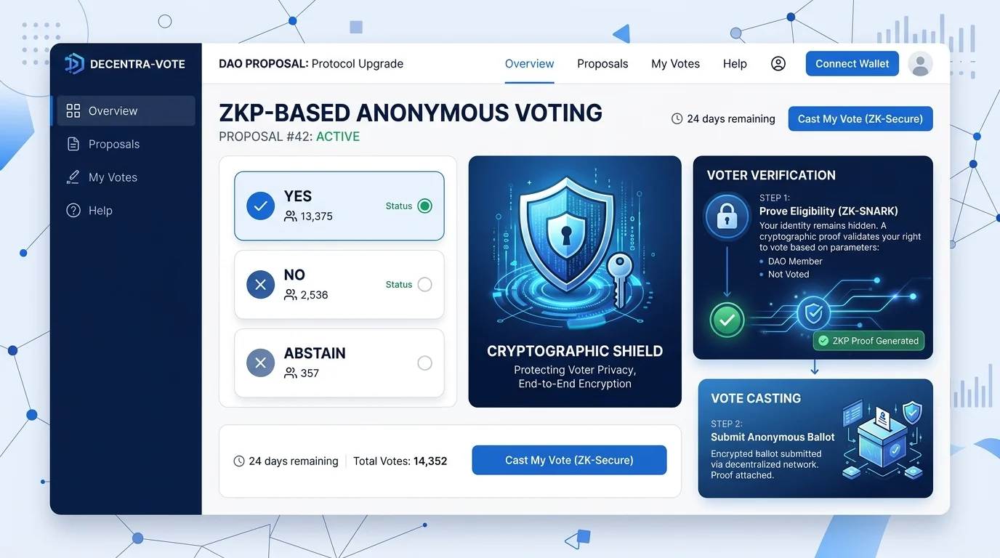

<p align="center">
  <a href="https://github.com/sanketpadhyal/TrueVote">
    
  </a>
</p>

<h1 align="center">TrueVote</h1>

<p align="center">
  A decentralized, privacy-preserving Web3 voting platform with zero-knowledge nullifiers, Cloudflare Turnstile bot resistance, and IPFS persistence.
</p>

<p align="center">
  <a href="https://github.com/sanketpadhyal/TrueVote"><strong>Explore TrueVote Repository</strong></a>
  &nbsp;&middot;&nbsp;
  <a href="../../releases">All Releases</a>
  &nbsp;&middot;&nbsp;
  <a href="../../issues">Report a Problem</a>
</p>

<p align="center">
  <a href="../../releases/latest">
    
  </a>
  <a href="../../releases/latest">
    
  </a>
  
  
  
</p>

> [!IMPORTANT]
> TrueVote provides client-side zero-knowledge proof (ZKP) nullifier verification and browser-level anti-bot entropy heuristics. Votes are cryptographically bound to voter credentials without exposing their identity on the blockchain or decentralized storage.

> [!IMPORTANT]
> Live ballot audits and decentralized pinning are powered by IPFS and Pinata Dedicated Gateways. Once cast, cryptographic election records cannot be altered or retroactively manipulated.

## What's New in TrueVote v2.0.0

TrueVote v2.0.0 is a major production release introducing UPI/PhonePe-style transactional celebration sequences, strict revote locking across browser sessions, real headless bot heuristics with human entropy verification, dynamic frontrunner tracking pills, dual IndexedDB and Pinata IPFS synchronization, and a fully optimized O(N) zero-comment production architecture.

### Major Highlights

- PhonePe / UPI-Style Celebration Animation: Verified vote submission triggers an animated multi-stage confirmation sequence featuring radial ripple waves, a pop badge with SVG stroke checkmark drawing, directional sparkle particles, and staggered transactional receipt cards.
- Strict Revote Locking & One-Vote Enforcement: Dynamic cryptographic nullifier verification prevents double voting. Once a ballot is sealed, IndexedDB and browser storage persist the voter lock, replacing ballot selection with an immutable confirmation state upon return.
- Real Headless Bot Heuristics & Human Entropy: Native Cloudflare Turnstile integration augmented with client-side automated test runner detection (`navigator.webdriver`) and human entropy tracking (requiring genuine cursor movement or touch tap gestures prior to challenge resolution).
- Real-Time Leading Candidate Pill: High-performance O(N) tally calculation with a dynamic "Leading" pill badge highlighting the frontrunner across active voting ballots and administrative analytics tables.
- Dual IndexedDB & Pinata IPFS Synchronization: Client-side persistence using IndexedDB (`truevote_persistence_db`) paired with automated JSON pinning to Pinata IPFS V3 dedicated gateways for decentralized record immutability.
- Cleaned Production Architecture: Strict O(N) data processing algorithms, optimized re-render trees, zero development comments, and sanitized production builds.

---

## About TrueVote

TrueVote is an open-source decentralized voting platform engineered to deliver anonymous, verifiable, and tamper-proof elections. Traditional electronic voting systems rely on centralized databases vulnerable to insider manipulation, single points of failure, and voter de-anonymization. TrueVote eliminates these vulnerabilities through a hybrid cryptographic architecture:

1. Anonymous Participation: Voters can participate using Web3 wallets (MetaMask) or zero-credential walletless mode without creating platform accounts.
2. Cryptographic Voter Nullifiers: Client-side deterministic hashes ensure one-person-one-vote enforcement without recording personal identities or wallet addresses alongside ballot choices.
3. Decentralized Storage: Election manifests, candidate configurations, and vote tallies are pinned directly to IPFS via Pinata Dedicated Gateways, creating a permanent, audit-ready paper trail.
4. Bot Resistance: Client-side heuristics and Cloudflare Turnstile protect public election links from automated submission scripts, headless Selenium/Puppeteer bots, and Sybil flooding.

## App Preview

<p align="center">
  
  
</p>

<p align="center">
  
</p>

## What You Can Do

### Anonymous Voting

- Cast confidential ballots on active elections without registering personal details.
- Generate client-side cryptographic voter nullifiers to prevent duplicate submissions.
- Receive a deterministic transaction hash and cryptographic verification receipt upon submission.
- Experience smooth visual confirmation with the PhonePe-style celebration modal.

### Web3 & Walletless Modes

- Connect via MetaMask or standard Web3 browser providers (EIP-1193).
- Utilize walletless mode where voter nullifiers are derived from secure browser entropy and session salt.
- Switch between decentralized networks without losing local election state.

### Anti-Bot & Proof of Humanity

- Automatic challenge verification powered by Cloudflare Turnstile.
- Headless runner detection intercepting automated test drivers (`navigator.webdriver`).
- Human entropy tracking requiring authentic mouse gestures (`mousemove`) or mobile touch taps (`touchstart`).
- Automatic bot blocking with contextual security exceptions.

### Election Administration & Analytics

- Create custom elections with flexible candidate lists, descriptions, and duration limits.
- Monitor live turnout rates, percentage breakdowns, and total vote tallies.
- Track real-time election frontrunners through automated leader badges.
- Pause, resume, or close elections with instant cross-tab propagation via BroadcastChannel.
- Pin election data directly to Pinata IPFS with dedicated gateway retrieval URLs.

## Voter & Election Lifecycle

1. Election Creation: The organizer creates an election on the Organizer Dashboard, defining candidate options, end times, and voting parameters. The event is saved to IndexedDB and pinned to IPFS.
2. Link Distribution: The organizer shares the election link or 6-digit voting code with eligible voters.
3. Bot & Entropy Verification: The voter opens the voting page. TrueVote runs headless runner checks and listens for genuine human cursor or touch interactions before resolving Cloudflare Turnstile.
4. Candidate Selection: The voter reviews candidates, real-time leading candidate badges, and select their preferred choice.
5. Nullifier Generation & Submission: TrueVote computes the client-side voter nullifier, verifies eligibility, increments the candidate tally, and pins the updated record to IPFS.
6. Celebration & Revote Lock: The PhonePe-style animation confirms the ballot. The voter lock is persisted in IndexedDB and browser storage to block subsequent submissions.

## Main App Areas

| Area | Purpose |
| --- | --- |
| Landing (`/`) | Product overview, cryptographic guarantees, feature highlights, and navigation entry |
| Dashboard (`/dashboard`) | Election management, event tables, KPI statistics, pause/quit actions, and IPFS status |
| New Event Modal | Step-by-step form to launch new elections with candidate configurations and IPFS pinning |
| Voting Page (`/vote/:id`) | Voter interface featuring candidate selection, leader pill, Turnstile challenge, and submission |
| Celebration Modal | UPI-style visual confirmation with ripples, checkmark animation, sparkles, and receipt card |
| Realtime Analytics Modal | Modal displaying vote share percentages, leading candidate badges, and total voter turnout |

## Cryptographic & Security Architecture

### Zero-Knowledge Voter Nullifiers

To enforce the one-person-one-vote rule without compromising anonymity, TrueVote utilizes deterministic client-side nullifier hashing:

- A unique nullifier is derived using SHA-256 over the election identifier, voter salt, and entropy signature.
- The nullifier is recorded in the election manifest to verify ballot uniqueness.
- The voter's underlying identity or wallet address is never linked to the selected candidate index, ensuring privacy.

### Headless Bot Detection & Human Entropy

TrueVote implements client-side behavioral heuristics to ensure genuine human participation:

- `navigator.webdriver` Verification: Immediately flags automated test runners (e.g., Selenium, Puppeteer, Playwright).
- Human Entropy Tracking: Listens for authentic pointer movements (`mousemove`) or touch inputs (`touchstart`) with non-zero coordinate variance before enabling Turnstile completion.
- Re-challenge Threshold: Repeated automated attempts result in locked ballot states and security alert banners.

### Decentralized Storage & Ledger Replication

- IPFS Content Addressing: Election manifests and ballot records are uploaded as JSON documents via Pinata IPFS V3 endpoints.
- Pinata Dedicated Gateway: Content retrieval runs through high-availability Pinata gateways with fallback failover.
- IndexedDB Backup: Browser sessions synchronize election data into a local IndexedDB store (`truevote_persistence_db`) for offline resiliency.
- Cross-Tab BroadcastChannel: Multi-window dashboard sessions maintain state synchronization in real time via `BroadcastChannel('truevote_events_channel')`.

## Supported Networks & Storage

| Layer | Provider / Standard | Status |
| --- | --- | --- |
| Web3 Provider | MetaMask (EIP-1193 / `window.ethereum`) | Supported |
| Decentralized Storage | Pinata IPFS (V3 REST API & Dedicated Gateway) | Supported |
| Local Backup | IndexedDB (`truevote_persistence_db`) | Supported |
| Tab Synchronization | HTML5 BroadcastChannel API | Supported |
| Anti-Bot Service | Cloudflare Turnstile & Heuristic Entropy Engine | Supported |

## Technical Stack

| Area | Technology | Version |
| --- | --- | --- |
| UI Framework | React | `19.3.0` |
| Web Routing | React Router DOM | `7.18.3` |
| Language | TypeScript | `4.9.5` |
| Build Tool | Create React App / React Scripts | `5.0.1` |
| Smooth Scrolling | Lenis | `1.3.26` |
| Decentralized Storage | Pinata IPFS REST API | V3 / Legacy Fallback |
| Local Database | IndexedDB | Standard Level 2 |
| Unit & Integration Testing | Jest & React Testing Library | `16.3.3` |
| DOM Assertions | Jest-DOM | `6.9.1` |

## Project Structure

```text
.
|-- public/
|   |-- images/
|   |   |-- logo.png                        Primary TrueVote branding mark
|   |   |-- privacy_dashboard.webp          Dashboard overview graphic
|   |   |-- vote.webp                       Voting ballot preview image
|   |   |-- illus.webp                      Cryptographic architecture illustration
|   |   `-- stacks/                         Technology badges (Pinata, IPFS, Cloudflare, etc.)
|   |-- favicon.ico                         Application favicon
|   |-- index.html                          HTML document template
|   `-- manifest.json                       Web app manifest configuration
|-- src/
|   |-- __mocks__/
|   |   `-- lenis.js                        Smooth scroll mock for Jest environment
|   |-- components/
|   |   |-- auth/                           Wallet connection and authentication modals
|   |   |-- box/                            Generic dialog and confirmation components
|   |   |-- navbar.tsx                      Global navigation bar with wallet status
|   |   |-- footer.tsx                      Application footer and resource links
|   |   |-- faq.tsx                         Frequently Asked Questions accordion
|   |   `-- scrolltotop.tsx                 Route change scroll restoration helper
|   |-- dashboard/
|   |   |-- Dashboard.tsx                   Main organizer dashboard coordinator
|   |   |-- EventsTable.tsx                 Paginated, searchable election management table
|   |   |-- NewEventModal.tsx               Election creator workflow modal
|   |   |-- RealtimeAnalyticsModal.tsx      Live vote share and turnout breakdown
|   |   |-- HeroBanner.tsx                  Organizer summary and quick action banner
|   |   |-- StatsPanel.tsx                  Aggregated KPI metrics cards
|   |   |-- ActionCards.tsx                 Election status quick filter cards
|   |   |-- Sidebar.tsx                     Dashboard navigation sidebar
|   |   `-- types.ts                        TypeScript interfaces for elections and ballots
|   |-- pages/
|   |   |-- home.tsx                        Public marketing and platform overview page
|   |   `-- dashboard.tsx                   Dashboard route wrapper
|   |-- services/
|   |   |-- pinata.ts                       Pinata IPFS V3 pinning and gateway client
|   |   `-- storage.ts                      IndexedDB database and local backup handlers
|   |-- styles/
|   |   `-- animations.css                  Keyframe animations and ripple effects
|   |-- voting/
|   |   |-- VotingPage.tsx                  Voter ballot interface with Turnstile challenge
|   |   `-- voting.css                      Ballot styling and PhonePe celebration keyframes
|   |-- App.tsx                             Root router configuration and provider tree
|   |-- index.tsx                           React application bootstrap
|   `-- setupTests.js                       Jest global test setup and DOM polyfills
|-- package.json                            Project dependencies and build scripts
|-- tsconfig.json                           TypeScript compiler options
`-- README.md                               Project documentation
```

## Configuration Notes & Environment Variables

Create a `.env` file in the project root to configure custom Pinata IPFS credentials or Cloudflare Turnstile keys:

```bash
# Pinata IPFS Configuration
REACT_APP_PINATA_JWT=your_pinata_jwt_token_here
REACT_APP_PINATA_GATEWAY_URL=https://your-custom-gateway.mypinata.cloud/ipfs/
REACT_APP_PINATA_API_KEY=your_optional_pinata_api_key
REACT_APP_PINATA_SECRET_KEY=your_optional_pinata_secret_key

# Cloudflare Turnstile Configuration
REACT_APP_TURNSTILE_SITE_KEY=your_cloudflare_turnstile_site_key

# Build Optimization
GENERATE_SOURCEMAP=false
```

- When `REACT_APP_PINATA_JWT` is omitted, TrueVote defaults to the configured production Pinata gateway.
- Client-side bot defense operates in deterministic heuristic mode if a custom Turnstile site key is not supplied.

## Current Status

| Feature | Status |
| --- | --- |
| Web3 Wallet Connection | Fully Operational |
| Anonymous Voter Nullifiers | Fully Operational |
| Cloudflare Turnstile Integration | Fully Operational |
| Headless Bot & Entropy Detection | Fully Operational |
| Pinata IPFS V3 Pinning | Fully Operational |
| IndexedDB Client Backup | Fully Operational |
| UPI/PhonePe Celebration Animation | Fully Operational |
| Persistent Revote Locking | Fully Operational |
| Real-Time Leader Pill Calculation | Fully Operational |
| Live Analytics & Audit Modal | Fully Operational |

## Local Development Setup

Follow these steps to set up and run TrueVote on your local workstation.

### 1. Prerequisites

Ensure you have the following installed:

- Node.js `18.0.0` or newer (Node `20.x` or `22.x` recommended).
- npm `9.0.0` or newer.
- A modern web browser with MetaMask installed (optional for walletless testing).

### 2. Clone the Repository

```bash
git clone https://github.com/sanketpadhyal/TrueVote.git
cd TrueVote/truevote
```

### 3. Install Dependencies

```bash
npm install
```

### 4. Configure Environment (Optional)

```bash
cp .env.example .env
```

Edit `.env` to provide your custom Pinata IPFS or Cloudflare credentials if desired.

### 5. Start the Development Server

```bash
npm start
```

The application will start on `http://localhost:3000`.

### 6. Run the Test Suite

```bash
npm test -- --watchAll=false
```

### 7. Build for Production

```bash
npm run build
```

Production build artifacts will be generated in the `build/` directory with source maps omitted for deployment optimization.

## Release Checklist

Before tagging and deploying a new release:

- Confirm all test suites pass with zero failures (`npm test -- --watchAll=false`).
- Verify production build succeeds without warnings (`npm run build`).
- Confirm IndexedDB initialization and backup persistence in clean browser profiles.
- Test IPFS upload and gateway retrieval using active Pinata credentials.
- Verify Turnstile challenge resolution and headless bot blocking on automated browsers.
- Confirm PhonePe-style celebration modal trigger and subsequent revote locking.
- Update release version numbers in `package.json` and documentation.

## License & Open Source Terms

This project is licensed under the MIT License - see the [LICENSE](LICENSE) file for details.

## Developer

- Developer: Sanket Padhyal
- Website: https://www.sanketpadhyal.in
- Support: sanketpadhyal3@gmail.com
- GitHub: https://github.com/sanketpadhyal

## Disclaimer

TrueVote provides cryptographic zero-knowledge nullifiers and decentralized data persistence as open-source client software. Users, organizers, and institutions are responsible for ensuring that their election parameters, legal voting requirements, and deployment practices comply with relevant local election laws, privacy standards, and regulatory frameworks.
